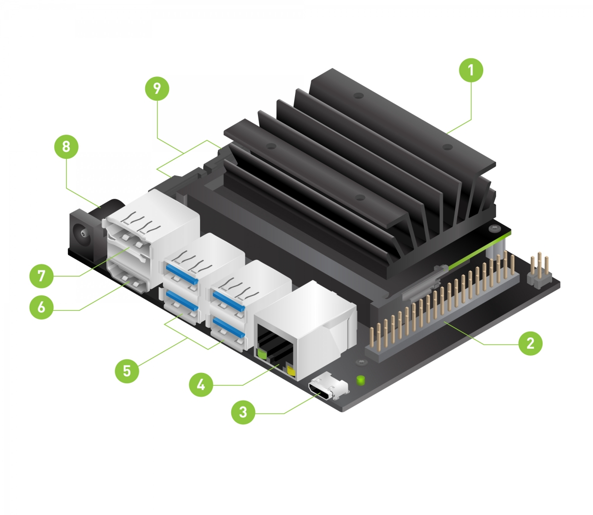
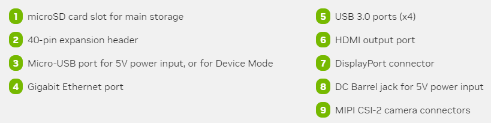
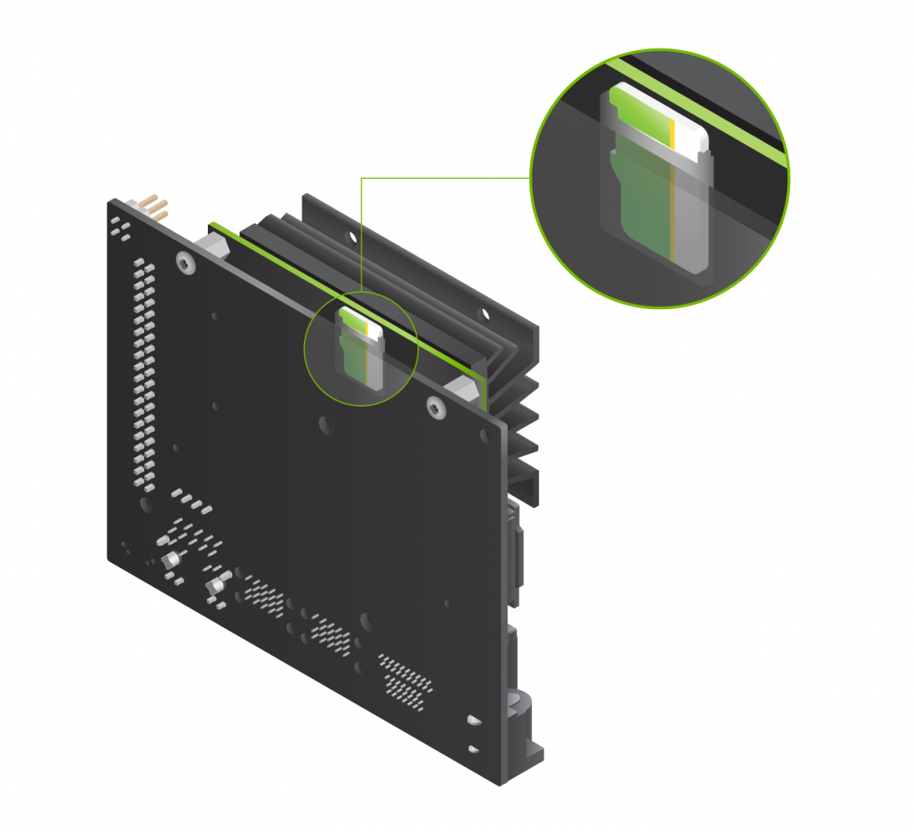

# Jetson Nano Setup

## Write Operating System Image to microSD Card

1. Download the Jetson Nano developer kit SD card image based on which Jetson Nano you are given (inspect your Jetson Nano box to check whether you have 2GB or 4GB):

* [4GB Jetson Nano Image](https://developer.nvidia.com/jetson-nano-sd-card-image)
* [2GB Jetson Nano Image](https://developer.nvidia.com/jetson-nano-2gb-sd-card-image)

2. Download and Install [Etcher](https://www.balena.io/etcher/).
3. Insert the microSD card into your computer. Depending on the ports you have available, you may need an adapter.
4. Open Etcher. Select "Flash from file", choose the SD card image you just downloaded. Hit "Select target" and choose the SD card if it is not automatically selected. Ignore all messages about the SD card being unreadable. Hit "Flash!". It will take about 15 minutes to flash the SD card.

## Boot and Connect

The following image is a reference image for the various Jetson Nano ports described in the following instructions.

1. Insert the flashed microSD card into the Jetson Nano (port 1 in the ref. image above).

2. Power on the Jetson Nano by connecting the DC barrel power cable (port 8 in the ref. image). Wait about 30 seconds for it to boot up before continuing.

3. Connect the Jetson Nano to your laptop with the Micro-USB to USB cable (port 3 in the ref. image). 

## Establish USB Connection

You should wait at least 1 minute after powering on before attempting to connect to the Jetson Nano for the first time. This gives it ample time to boot up and perform the initial configuration.

### MacOS/Linux

1. Open a terminal. Enter the command `ls /dev/cu.usbmodem*` to list the Jetson Nano USB connection.

2. Enter `sudo screen <your_connection_name>` where `<your_connection_name>` is returned by the previous command. You will be prompted for your local machine password. You should see the following initial configuration screen: 

  

### Windows

1. Right click on the Windows icon and select "Device Manager".

2. Open "Ports (COM & LPT)". Double click "USB Serial Device". Navigate to "Details" and select "Hardware Ids". You should see the following values:

  

3. Note the number next to "COM" in parenthesis. We need this number to connect to the Jetson Nano serially.

4. Open PuTTY, or download and install it from [here](https://www.chiark.greenend.org.uk/~sgtatham/putty/latest.html).

5. Select "Session". Under "Connection type:" choose "Serial". Enter the COM number in "Serial line" and set the connection speed to 115200. Feel free to click "Save" to save these configurations for later use. 

  

6. Click "Open" to connect to the Jetson Nano.

## OS Setup

1. Hit enter to continue. Accept the license terms. (You can avoid scrolling all the way through by hitting the right arrow). Select your language, etc.

2. Enter your name, then enter your favorite username e.g., your UNI (The username can be the same as your name): 

  

3. Choose a password. Don't forget it (it can be simple).
 

  

4. You will be prompted to choose the APP partition size. The default is the maximum available size. Leave as is.
 

  

5. Next you it will ask you to configure the network. We will be using a network connnection option (USB Wifi Driver) that is not listed. Choose "USB net" and hit OK. The configuration will fail, but this is expected.  

  

You will see the following screen: 

  

Choose "Do not configure the network at this time".

6. Enter your UNI as the Hostname. 

  

7. On the final page, accept the default setting. Wait until the setup is complete, then reboot the Jetson Nano with the command `sudo reboot now`. Exit the terminal. 

## Enable Internet Access
There are two ways we can enable internet access on the Jetson Nano. 
1. Connect to the internet using an ethernet cable.
2. Install and mount a Wifi driver.

Regardless of which option you choose, **please go through the steps of the second option in the section** "Install and Mount Wifi Driver" when performing this setup. This is a one-time installation. 

When physically present in the lab, it is recommended to use (1.) an ethernet cable for more stable connection. 

## Connect Jetson Nano to the Internet Using an Ethernet Cable

Now that the Jetson Nano OS is configured, we will connect to the internet using an ethernet cable (see the next section to connect via WIFI). Do not disconnect the Micro-USB cable (port 3 in the ref image).

1. **MAC/Linux**: In a new terminal enter `ssh username@192.168.55.1`. The IP address 192.168.55.1 is specific to the USB interface with Jetson Nano. You will be prompted to continue despite the failing to authenticicate the host. Type "yes" and hit enter. **Windows**: If you are on **Windows**, you can use PuTTY to SSH, or you can connect to your Jetson Nano by using the configurations you saved earlier (this option requires the Micro-USB to be plugged in when working on the Jetson Nano). 
3. Although we are connected to the Jetson Nano via SSH, we are not connected to the internet. For cable connection, you can use the ethernet cable provided in your equipment box. Connect one end to the Jetson Nano and the other to the ethernet port on your desk (you can find the port behind the lab monitors that the lab computer is connected to).
4. Test the connection with `ping google.com` (or some other website). You should see packet transmission info. To terminate `ping` enter ctrl+C. 
5. Before disconnecting the Micro-USB, enter `ifconfig` to find the IP address of the Jetson Nano. The IP address we're interested in is the one under "eth0". We will be using that later.

## Computing Environment Setup

1. To pull the docker enter `sudo docker pull nvcr.io/nvidia/l4t-ml:r32.6.1-py3`. It may take several minutes to download all the files. 
2. To mount the docker use `sudo docker run -it --rm --runtime nvidia --network host nvcr.io/nvidia/l4t-ml:r32.6.1-py3`. This opens the docker shell in interactive mode `--it` and starts the Jupyter Lab server. You should see the following information about the port and IP address of the Jupyter server.

3. Validate that the relevant packages are installed and ready to go by entering `python3`, then in the Python shell enter `import torch`. There should be no error messages. 

4. To dismount the docker enter `exit`. This will close the container shell and stop the Jupyter server.

### Docker Management

When `--rm` is specified when mounting the docker, the container is deleted upon exiting. Note that a container is an instance of a docker image. Deleting containers when they are not in use saves space on the Jetson Nano, but it also deletes all of your work... To save changes we will primarily use git rather than committing changes directly to the docker image. However, there are a couple configuration changes we need to make to the docker image. These changes include caching your GitHub credentials and cloning the GitHub repository. After saving these changes to the docker image, we will not have to perform them each time the docker is mounted.

1. Mount the docker without specifying the remove tag with `sudo docker run -it --runtime nvidia --network host nvcr.io/nvidia/l4t-ml:r32.6.1-py3`. 

2. Install the GitHub command line interface to cache your GitHub credentials. Enter the following commands:
* `curl -fsSL https://cli.github.com/packages/githubcli-archive-keyring.gpg | dd of=/usr/share/keyrings/githubcli-archive-keyring.gpg`
* `echo "deb [arch=$(dpkg --print-architecture) signed-by=/usr/share/keyrings/githubcli-archive-keyring.gpg] https://cli.github.com/packages stable main" | tee /etc/apt/sources.list.d/github-cli.list > /dev/null`
* `apt update`
* `apt install gh`

3. Enter `gh auth login` and follow prompts to authenticate. Now git will not ask for your credentials.

4. Clone the repository with `git clone <URL>`.

5. Cache your email and name with `git config --global user.email "you@example.com"` and `git config --global user.name "Your Name"`

6. Dismount the docker by entering `exit`.

7. Once the container is exited, enter `sudo docker ps --all --size --filter Status=exited` to list containers that have been exited (and not deleted). You should see something similar to the following list. Note the container ID of the most recent container.

8. Commit your changes in the container we just exited to the docker image with `sudo docker commit container_id nvcr.io/nvidia/l4t-ml:r32.6.1-py3`.

9. Mount the modified docker with the remove tag specified `sudo docker run -it --rm --runtime nvidia --network host nvcr.io/nvidia/l4t-ml:r32.6.1-py3`. Navigate to the repository to confirm that the changes were committed. 

### Mounting Volumes

To include data or other directories when mounting the docker, you need to specify them with the `-v` flag. Mount volumes in the docker with 

`sudo docker run -it --rm --runtime nvidia --network host -v jetson_path:docker_path nvcr.io/nvidia/l4t-ml:r32.6.1-py3`

where `jetson_path` is the path to the data on your Jetson Nano and `docker_path` is the path to where you want the data to be in the docker. For instance, if you need a large data file (larger than GitHub allows) to complete a lab, it would be a good idea to scp the data from your laptop to the Jetson Nano, then mount the data in a data folder within the git repository. Make sure to add the large data to the .gitignore to avoid accidentally pushing it.

## Open Jupyter Lab

1. To open Jupyter Lab, enter the IP address of the Jetson Nano followed by the port 8888 in a browser: `Jetson_ip_address:8888`.
2. You will be prompted to enter a password. The password is "nvidia". Once Jupyter Lab is open, you should see the lab repository on the left side in the file viewer. 

NOTE: To ensure that your work is saved, we highly recommend frequent pushes to GitHub (i.e. `git add .`, `git commit -m "message"`, `git push`). Each time you mount the docker you will need to do `git pull` to see your changes. 

### Miscelaneous Useful Commands

Delete containers with `sudo docker rm container_id`

List docker images with `sudo docker images`

To undo a commit without deleting your local changes: `git reset --soft HEAD~1`

